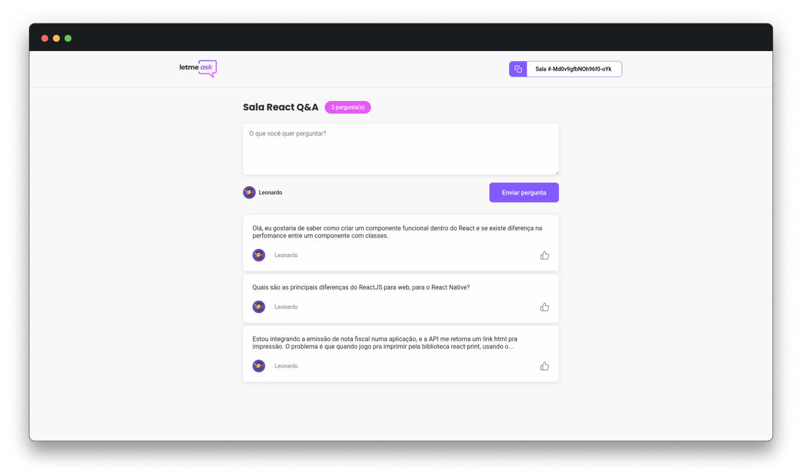

<p align="center">
  
</p>
<h1 align="center">Letme ask</h1>

<p align="center">
  
  
</p>

## 💻 Projeto

O Letme ask é um app para gerenciamento de salas de Q&A.
Foi o projeto criado na 6ª. Edição da NLW (Evento criado pela [Rocketseat](https://rocketseat.com.br))

## 🔖 Layout

Você pode visualizar o layout do projeto através [desse link](https://www.figma.com/file/jeb9iKsB0sLI44C5dXYR9Y/Letmeask). É necessário ter conta no [Figma](http://figma.com/) para acessá-lo.

## ✨ Tecnologias

Esse projeto foi desenvolvido com as seguintes tecnologias:

- [React](https://reactjs.org)
- [TypeScript](https://www.typescriptlang.org/)
- [Firebase Realtime Database](https://firebase.google.com/docs/database)

## 📷 Preview

Visualização de exemplo do app:


## 🔗 Como acessar

O projeto está hospedado no github pages e pode ser acessado através [desse link](https://leopinnheiro.github.io/nlw06-letmeask/)

## 🚀 Como executar localmente

Clone o repositório, abra a pasta e instale as dependências com:

```sh
yarn
```

Execute usando:

```sh
yarn start
```

Agora você pode acessar [`localhost:3000`](http://localhost:3000) do seu navegador.

## 📄 Licença

Esse projeto está sob a licença MIT. Veja o arquivo [LICENSE](LICENSE.md) para mais detalhes.
